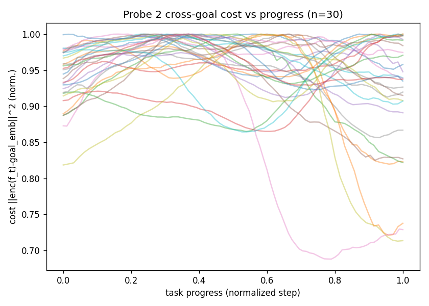
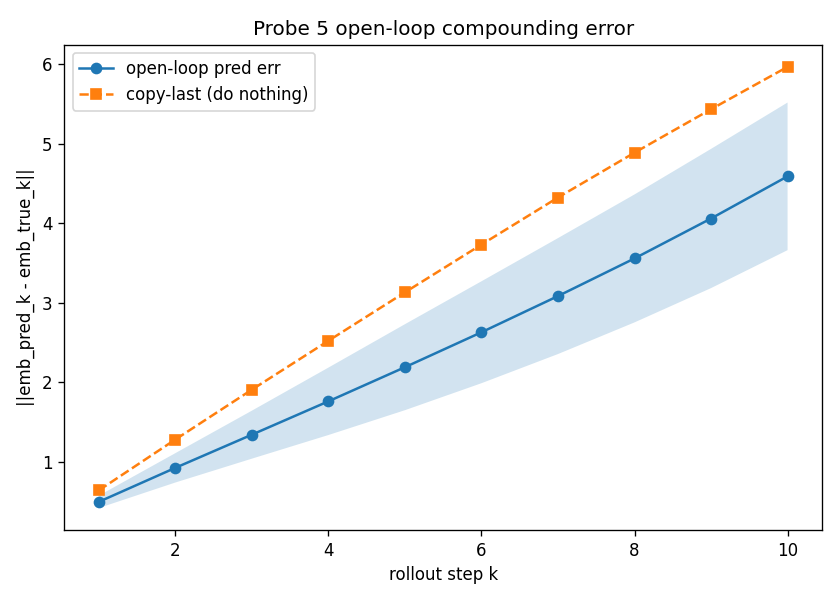

# LeWM 关抽屉任务诊断报告 / LeWM Drawer-Close Diagnostics Report
### 组会版 · 中英对照 / Group-Meeting Edition · Bilingual

> 任务 / Task：LIBERO `KITCHEN_SCENE10_close_the_top_drawer`（关上柜子顶层抽屉 / close the top drawer）
> 模型 / Model：双相机 JEPA 世界模型 `lewm_libero_bc_drawer_v2_epoch_200`
> 日期 / Date：2026-06-10　|　脚本 / Scripts：`diagnostics/`　|　图 / Figures：`diagnostics/results/report_figs/`
> 所有图由 `diagnostics/make_report_figs.py` 从保存的 `.npz` 重新生成（可复现）。
> *All figures are regenerated from saved `.npz` artifacts via `make_report_figs.py` (reproducible).*

**阅读顺序 / Reading order**：§0 系统总览 → §1 测试的原理与方法 → §2 结果 → §3 总结（瓶颈定位）→ §4 改进（已做的改动 + 下一步路线）。
*System overview → why/how we test → results → summary (where the bottleneck is) → improvements (what I changed + roadmap).*

---

> **📌 2026-06-22 更新 / Update**：§0–§3 的瓶颈诊断结论不变（cost 是瓶颈）。重大进展在 §4.2 **改动三**：后处理的冻结解码器 D_φ（闸2 = 0% FAIL，OOD 利用）已被**协同训练的 physics head** 取代——同一个 head 同时回流 encoder 与 predictor 梯度。**闸2 由 FAIL→PASS**（oracle 动力学下 phys cost 关上抽屉，e200 **5/8 = 62.5%**；lewm 仍 0%）。新增 `p6_oracle.py --cost-curve` 沿 planner 实轨直接量化"cost 是否撒谎"：phys ρ(plan,true)=**+1.00**（诚实），lewm=**−0.55**（撒谎）。脚本/产物全清单见 [`../INDEX.md`](../INDEX.md)。
> *Bottleneck conclusion unchanged (cost is the bottleneck). Key progress in §4.2 **Change 3**: the post-hoc frozen decoder D_φ (gate-2 = 0% FAIL via OOD exploitation) is replaced by a **co-trained physics head** (one shared head back-props into both encoder and predictor). **Gate-2 flips FAIL→PASS** (under oracle dynamics the phys cost closes the drawer; lewm still 0%). New `p6_oracle.py --cost-curve` directly quantifies cost honesty along the planner's actual trajectory: phys ρ(plan,true)=+1.00 (honest), lewm=−0.55 (lying). Full script/artifact map: [`../INDEX.md`](../INDEX.md).*

---

## 0. 系统总览：这套系统怎么干活 / System Overview

我们的机器人**不是**"看图→直接输出动作",而是一个**世界模型 + 规划**的系统。
*The robot does not map pixels directly to actions. It is a world-model + planning system.*

```
        ┌─────────┐  把图压成          ┌──────────┐  想象"这样动以后        ┌────────┐
 摄像头 │ encoder  │  192个数字(emb)  │ predictor │  会变成什么样"        │  cost  │ 给"离目标多近"打分
 画面 → │ 编码器   │ ───────────────→ │  预测器   │ ──────────────────→  │ 代价   │ ──────┐
        └─────────┘                   └──────────┘                       └────────┘       │
                                                                                           ▼
                                                       CEM 规划器：试 300 组动作，挑 cost 最低的那组执行
```

四个部件，缺一不可 / Four components, all required：
- **encoder 编码器**：把一张 224×224 的图压成 **192 个数字**（embedding，简称 emb）。后续模块只能看这 192 个数字。
  *Compresses a 224×224 image into **192 numbers** (the embedding). Everything downstream sees only these 192 numbers, never the raw image.*
- **predictor 预测器**：给定历史，想象"执行某串动作后，未来的 emb 长什么样"。
  *Given history, imagines the future emb after executing a candidate action sequence.*
- **cost 代价函数**：给一个 emb 打分，表示"离目标还有多远"。越低越接近完成。
  *Scores how far an emb is from the goal; lower = closer to done.*
- **CEM 规划器 / planner**：随机生成几百组候选动作，用 predictor 想象结果、用 cost 打分，挑最优执行。
  *Samples hundreds of action candidates, rolls them out with the predictor, scores them with the cost, executes the best.*

**核心问题 / Core question**：这套系统关抽屉只有约 **10%** 成功率（§2.8）。**四个部件里，到底哪个拖了后腿？**
*The full system closes the drawer only ~10% of the time. Which of the four components is the bottleneck?*

**诊断思路 = 排除法 / Diagnosis = ablation**：不去猜，而是**一次只把一个部件换成"完美版"**，看成功率变不变。哪个换成完美版后任务就成了，瓶颈就在它。
*Don't guess — replace one component at a time with a perfect version and watch the success rate. Whichever fixes the task is the bottleneck.*

---

## 1. 测试的原理与方法 / Test Principles & Methods

本节只讲**每个测试"为什么这么测"(原理) 和"具体怎么测"(方法)**；结果统一放在 §2。
*This section gives only the **rationale (why)** and **implementation (how)** of each test. All results are collected in §2.*

### 1.1 p0 — 编码器/预测器本身健康吗 / Are the encoder & predictor healthy?

**原理 / Principle**：先排除"模型根本没练好"。两件事——(a) 在训练数据上做**单步预测**（给真历史，预测下一帧 emb），准不准；(b) 检查**表征坍缩**：编码器是否把所有图都压成几乎一样的数字（等于没学）。
*First rule out "the model never trained properly." (a) single-step teacher-forced prediction error on training data; (b) representation collapse — does the encoder map every image to nearly the same numbers?*

**方法 / Method**（`p0_sanity.py`）：40 条训练轨迹算单步预测相对误差；对全部 emb 做协方差特征值分解，算**有效秩**（实际用了多少维 / 192）。
*40 train trajectories for single-step error; eigen-decompose the emb covariance for the **effective rank** (how many of the 192 dims are actually used).*

### 1.2 p4 — 是不是数据不够 / Is the data insufficient?

**原理 / Principle**：用**生成数据的那个专家策略**（BC, Behavioral Cloning）直接跑同一个任务。它若能成，说明数据里的信息足够；那 LeWM 失败只能怪 LeWM 自己，不能怪数据。
*Run the **expert BC policy that generated the data** on the same task. If it succeeds, the data contains enough information, so any LeWM failure is LeWM's fault, not the data's.*

**方法 / Method**（`p4_bc_eval.py`）：加载标准 LIBERO BCTransformer，关抽屉任务跑 20 次。
*Load the standard LIBERO BCTransformer; 20 rollouts on the drawer-close task.*

### 1.3 p3 / p3b / p3c — 任务信息进没进那 192 个数字 / Is the task info inside the 192 numbers?

**原理——"探针 / 还原考试" / Principle — probing**：训一个小模型（探针），只看 192 个数字，让它猜真实物理量（手爪坐标、抽屉开合、够抽屉的距离）。**猜得准 = 信息在 emb 里**；猜不准 = 编码器把它丢了。打分用 **R²**（0=瞎猜，1=完美还原）。两种考生：linear（简单线性读取）与 MLP（带非线性）。
*Train a small probe that sees only the 192 numbers and predicts privileged physical quantities (gripper pose, drawer opening, reach distance). Accurate = the info is in the emb; inaccurate = the encoder dropped it. Scored by **R²** (0 = chance, 1 = perfect). Two probes: linear and MLP (nonlinear).*

**方法 / Method**：
- `p3_probe.py`：解码本体（手爪位置/姿态、夹爪、抽屉开合）。
- `p3b_reach.py`：解码 reach = ‖手爪 − 抽屉‖ 及完整目标分数。
- `p3c_cam_ablation.py`：**配对对照单相机 vs 双相机**——同 epoch、emb 同为 192 维（无维度混淆），唯一区别是有没有腕相机，看 ΔR²。
*decode proprio / reach / a matched mono-vs-dual ablation (same epoch, both 192-d, only difference = wrist camera), comparing ΔR².*

### 1.4 p2 / p2b — 原版 cost 的"形状"对不对 / Is the cost shaped correctly?

**原理 / Principle**：原版 cost = "当前帧 emb 与目标图 emb 的欧氏距离"。好 cost 应**随任务推进单调下降**。沿一条**已知成功**的轨迹逐帧算 cost，用 **Spearman ρ** 衡量"进度↔cost"相关：ρ≈−1 好，ρ≈0 与进度无关（坏）。**假洼地 false valley** = 中途某帧 cost 比终点还低，会把规划器骗住。
*Original cost = Euclidean distance between current-frame emb and goal-image emb. A good cost decreases monotonically with progress. Along a known-successful trajectory, measure Spearman ρ(progress, cost): ≈−1 good, ≈0 useless. A **false valley** = a mid-trajectory frame whose cost is below the goal's — a trap for the planner.*

两种目标设定 / two goal settings：`same`（目标图取自同一轨迹，理想）与 **`cross`（目标图取自另一条轨迹——这正是真实 eval 的用法）**。
*`same` (goal from the same trajectory, idealized) vs **`cross` (goal from a different trajectory — exactly how real eval works)**.*

**方法 / Method**：`p2_cost_mono.py`（统合原版 cost / 解码 cost / phys-head cost / truth，旧 `p2b_decoded_mono.py` 已并入，见 §4）。

### 1.5 p5 — 多步想象的误差会滚雪球吗 / Does open-loop error compound?

**原理 / Principle**：训练时预测器只学"准一步"。但规划要连续想象多步，且从第二步起喂的是**它自己上一步的预测**（不再是真实画面）——误差会不会越滚越大？对照"复制上一帧"的天然漂移基线。
*Training only teaches one-step accuracy, but planning rolls out many steps feeding the predictor its own prediction. Does error blow up? Compared against a copy-last-frame drift baseline.*

**方法 / Method**（`p5_openloop.py`）：30 条轨迹，自回归想象 10 步，记每步 emb 的 L2 误差。

### 1.6 p6 — 决定性实验：把部件换成"完美版" / The decisive experiment

**这是最关键的一步 / The single most important test。**

**原理 / Principle**：把 MPC 循环里**学到的预测器整个换成真正的 MuJoCo 模拟器**（完美物理），从而彻底排除"预测器拖后腿"。然后只对比 cost。
*Replace the learned predictor entirely with the real MuJoCo simulator (perfect physics), removing the predictor as a suspect. Then compare only the cost.*

**还有 predictor 吗?——没有 / Is there still a predictor? — No**：学到的 predictor 被模拟器**完全替换**,未来不再"想象"而是真实地走一遍。只有 encoder + cost + CEM 仍是 le-wm 的。
*The learned predictor is **entirely replaced** by the simulator — the future is truly simulated, not imagined. Only encoder + cost + CEM remain le-wm's.*

**输入是什么 / What is the input**：每步 CEM 从一个**存档的真实状态 `s_t`** 出发,把候选动作序列**真的丢进模拟器执行**,渲染出**真实未来帧**(双相机 agentview + eye_in_hand),再用 le-wm 真编码器编码。
*Each CEM step starts from a saved true sim state `s_t`, actually executes candidate actions in the simulator, renders the true future frames (dual camera), then encodes them with le-wm's real encoder.*

```
存档 s_t → 模拟器真实执行候选动作 → 渲染真实未来帧 → le-wm 编码器编码 → 算 cost → CEM 挑最优
checkpoint s_t → execute candidates in real sim → render true frames → le-wm encoder → cost → CEM picks best
```

**两种 cost / The two costs**（`p6_oracle.py`）：
```
Cost A — lewm (原版, 看目标图 / original, goal-image based):
    cost = || encode(simulator_rendered_frame) − goal_emb ||²
    （编码模拟器渲染的真实终帧, 求与目标图 emb 的平方 L2 距离）
    完美物理 + 原版 cost / perfect physics + original cost

Cost B — privileged (读模拟器真实状态 / reads true sim state):
    cost = || eef_pos − drawer_front ||  +  30 · | drawer_q − closed |
              (reach: 够到抽屉)              (close: 推上抽屉, 权重 30)
    完美物理 + 完美 cost / perfect physics + perfect cost
```

**配套 p7 / companion**（`p7_subgoal.py`）：把单一终点目标拆成 4 个中间路标，看能否缓解坏 cost。

### 1.7 p9 — 真实端到端基线 / Real end-to-end baseline

**原理/方法 / Principle & Method**（`p9_real_mpc.py`）：全部用学到的部件（编码器+预测器+原版双相机 cost+CEM）驱动真实 LIBERO，跑 20 次。这是**部署时的真实数字**。
*Everything learned (encoder + predictor + original dual-camera cost + CEM) driving the real LIBERO env, 20 rollouts. This is the real deployment number.*

---

## 2. 结果 / Results

每个探测的结果统一按 **【图 Figure】→【数据 Data】→【分析 Analysis】** 三段写。
*Every probe's result follows the same triad: Figure → Data → Analysis.*

### 2.1 结论速览（一张图讲完整个故事）/ Headline

下表与 fig1 是后面所有探测的"总账";细分结果见 2.2–2.8。
*The table and fig1 are the ledger for everything below; per-probe breakdowns follow in 2.2–2.8.*


| Experiment | What changed | Success | Note |
|---|---|---|---|
| **BC policy** (p4) | expert policy that generated the data | **95%** | data is sufficient, task solvable |
| **Perfect physics + perfect cost** (p6 privileged) | predictor→real sim, cost→true state | **100%** | harness + encoder are fine |
| **Perfect physics + emb-L2 cost** (p6 lewm) | only the cost swapped back to original | **0%** | ← true cost=100%, original cost=0% |
| Perfect physics + subgoal cost (p7) | goal split into waypoints | 0% | subgoals don't rescue it |
| Perfect physics + decoded cost D_φ (§4.2 change 2) | post-hoc frozen decoder | 0% | OOD exploitation (FAIL) |
| **Perfect physics + phys-head cost** (§4.2 change 3) | co-trained head, replaces D_φ | **62.5%** | gate-2 FAIL→PASS (e200, 5/8) |
| **Real end-to-end** (p9) | all learned components | **~10%** | real deployment number (闸3 blocked by fk5) |

**一句话 / One line**：**瓶颈是 cost，不是编码器、不是预测器、不是数据。** 给系统一个"读真实状态"的完美 cost，同样的规划框架就 100% 完成；把 cost 换回"看目标图算距离"立刻掉到 0%。
*The bottleneck is the cost — not the encoder, predictor, or data. A perfect state-reading cost solves it (100%) with the same harness; switching back to the goal-image cost drops it to 0%.*

### 2.2 p0 结果 / Results — 编码器/预测器本身健康

**【图 / Figure】** 无独立图（纯数值指标）。 *No dedicated figure (scalar metrics only).*

**【数据 / Data】**

| Metric | Value (dual v2) |
|---|---|
| single-step rel. error | **2.3%** |
| model vs copy-last (ratio) | 0.32 / 1.00 = **0.32 (<1)** |
| effective rank | **69 / 192** |

**【分析 / Analysis】** 单步误差 2.3% 很小，说明预测器在熟悉数据上很准；model/copy 比 0.32（<1）说明它远胜"啥也不预测"、确实学到了动态；有效秩 69/192 说明没发生表征坍缩。**→ 编码器和预测器本身健康，问题不在"模型没学好"。**
*2.3% is small (accurate predictor); model/copy ratio 0.32 (<1) easily beats the do-nothing baseline (real dynamics learned); rank 69/192 means no collapse. → Encoder & predictor are healthy; not a training failure.*

> 注 / Note：此处为 **v2 双相机模型**的数字（与全报告一致）。对照旧单相机：单步误差 3.9%→2.3%、有效秩 55→69——加腕相机后表征更准、用了更多独立维度，与 §2.4/§4.1 的 ΔR² 互相印证。
> *These are the **dual-camera v2** numbers (consistent with the rest of the report). vs the old mono model: single-step error 3.9%→2.3%, effective rank 55→69 — the wrist camera makes the representation more accurate and richer, corroborating the ΔR² in §2.4/§4.1.*

### 2.3 p4 结果 / Results — 数据足够

**【图 / Figure】** fig1 最左柱（BC 95%）。 *Leftmost bar of fig1 (BC 95%).*

**【数据 / Data】** **19/20 = 95%**，平均 ~70 步完成。 *19/20 = 95%, ~70 steps on average.*

**【分析 / Analysis】** 生成数据的专家策略本身能 95% 关上抽屉，说明数据里的信息足够完成任务。**→ 瓶颈在世界模型+规划，不在数据。**
*The expert that generated the data closes the drawer 95% of the time → the data carries enough information. → The bottleneck is the world model + planning, not the data.*

### 2.4 p3/p3b/p3c 结果 / Results — 信息确实在 emb 里

**【图 / Figure】** 原生图 `p3b_reach.png`：reach 的逐点解码散点（横=真值，纵=预测，红线=理想 y=x，R²=0.705），直观看"信息确实可还原"；汇总图 `fig2`：左=各物理量解码 R²，右=腕相机对照 dual−mono ΔR²。
*Native `p3b_reach.png`: per-point decode scatter for reach (x=true, y=pred, red=ideal, R²=0.705); summary `fig2`: left = R² per quantity, right = wrist-cam ablation ΔR².*


**【数据 / Data】**

| Quantity | Decode R² (left) | Wrist-cam ΔR² (right) |
|---|---|---|
| eef_pos (gripper position) | 0.77 | **+0.068** |
| drawer (opening) | 0.77 | +0.053 |
| reach (gripper→drawer dist.) | 0.71 | **+0.091** |
| privileged (full goal) | 0.75 | +0.057 |

**【分析 / Analysis】** 四个物理量 R²≈0.71–0.77，都能从 192 个数字里解码出来 → 信息确实在 emb 里。腕相机对照 ΔR² 全为正、且**最大在 reach/eef**（腕相机近距离该管的量），是它真在起作用的机理证据（详见 §4.1）。**→ 信息在、编码器又健康，问题只能是"怎么用这些信息算 cost"。**
*All four quantities decode at R²≈0.71–0.77 → the info IS in the emb. The wrist-cam ΔR² is positive everywhere and largest on reach/eef (mechanistic evidence; see §4.1). → Since info is present and the encoder is healthy, the problem must be the cost form.*

### 2.5 p2/p2b 结果 / Results — 原版 cost 形状是坏的

**【图 / Figure】** 两张原生图直接对比"坏 cost vs 好 cost 的形状"：`p2_cost_mono.png` = 原版 emb-L2 cost 沿成功轨迹的曲线（**乱飘、不下降** → 坏）；`p2b_decoded_mono.png` = 解码 D_φ cost 的曲线（**随进度单调下降** → 好，对照 §4.2）。横轴都是任务进度。
*Two native figures contrast bad vs good cost shape: `p2_cost_mono.png` = original emb-L2 cost along successful trajectories (**wanders, no descent** → bad); `p2b_decoded_mono.png` = decoded D_φ cost (**monotone descent** → good, cf. §4.2). x-axis = task progress.*




**【数据 / Data】**

| Cost | Spearman ρ | False valleys |
|---|---|---|
| Original emb-L2 (cross, real deployment) | **+0.02** | **33.4** |
| (reference) decoded D_φ | −0.78 | 0.5 |

**【分析 / Analysis】** 原版 cost 的 ρ≈+0.02，几乎与任务进度无关；每条轨迹平均 33.4 个假洼地，等于到处是"假目标"陷阱。规划器拿着这种 cost 就像拿一张乱标的地图找路。**→ 原版 cost 形状是坏的，这解释了 2.6 里"完美物理+原版 cost=0%"。**
*Original cost ρ≈+0.02 (uncorrelated with progress) with 33.4 false valleys per trajectory — traps everywhere, like a mislabeled map. → The cost is mis-shaped; this explains the 0% in 2.6.*

### 2.6 p6 结果 / Results — 决定性铁证

**【图 / Figure】** fig1 第 2、3 柱（oracle+privileged 100% vs oracle+emb-L2 0%）。
*Bars 2–3 of fig1 (oracle+privileged 100% vs oracle+emb-L2 0%).*

**什么是 "perfect physics" / What "perfect physics" means**：指在 MPC 循环里把**学到的 predictor 整个换成真正的 MuJoCo 模拟器**——候选动作**真的在模拟器里执行**、用**真实**渲染出的未来帧/状态,而不是预测器"想象"的。所以动力学是**完全正确**的,任何失败都不能再赖到预测误差头上(详见 §1.6)。
*"Perfect physics" = in the MPC loop the learned predictor is entirely replaced by the real MuJoCo simulator: candidate actions are actually executed in the sim and the TRUE resulting frame/state is used, not an imagined one. Dynamics are exactly correct, so failure cannot be blamed on prediction error (see §1.6).*

**三种 cost（都在 perfect physics 下）/ The three costs (all under perfect physics)**：

```
privileged = ‖eef_pos − drawer_front‖  +  30 · |drawer_q − closed|
                (reach: 够到抽屉)            (close: 推上抽屉, 权重 30)   —— 读模拟器真实状态

lewm       = ‖ encode(rendered_frame) − goal_emb ‖²
                （渲染帧编码后, 与目标图 emb 的平方 L2 距离）            —— 原版, 看目标图

subgoal    = min_i ‖ encode(rendered_frame) − goal_emb_i ‖²   (i = 1..4)
                （同 lewm, 但取到 4 个路标里最近那个的距离）            —— p7 拆路标
```

**【数据 / Data】**

| Cost | Success |
|---|---|
| **privileged** (true state) | **6/6 = 100%** |
| **lewm** (original goal-image) | **0/8 = 0%** |
| **subgoal** (p7, 4 waypoints) | 0/8 = 0% |

**【分析 / Analysis】** 同样的编码器、同样的规划框架、同样的完美物理，**唯一变量是 cost**：换上读真实状态的好 cost = 100%，换回原版 = 0%。这是把瓶颈钉死在 cost 的铁证。p7 把目标拆成 4 路标仍 0/8——机械臂能依次"到达"每个路标（emb 距离下降）但抽屉没真关上，说明 **emb 距离低 ≠ 任务真完成**，拆路标救不了坏 cost。**→ 瓶颈 100% 锁定在 cost。**
*Only the cost varies: good state-reading cost = 100%, original = 0% — decisive. p7's 4 subgoals still 0/8: the arm "reaches" each waypoint in emb-space but never closes the drawer (low emb distance ≠ task done). → The bottleneck is unambiguously the cost.*

### 2.7 p5 结果 / Results — 误差累积但不发散

**【图 / Figure】** 原生图 `p5_openloop.png`：开环多步预测误差随步数 k 的增长（蓝=预测器开环误差，阴影=±std；橙虚线="复制上一帧"漂移基线）。
*Native `p5_openloop.png`: open-loop multi-step prediction error vs step k (blue = predictor open-loop error, shaded ±std; orange dashed = copy-last drift baseline).*



**【数据 / Data】** 第 10 步相对误差 ~33%；全程预测误差曲线 **始终低于** 复制上一帧基线。 *~33% at step 10; the predictor curve stays below the copy-last baseline throughout.*

**【分析 / Analysis】** 误差随步数近似线性增长（不是指数爆炸），且始终强于"啥也不预测"。**→ 误差会累积（是长程漂入 OOD 的一个来源），但没有灾难性发散，不是 0% 的主因；主因仍是 cost。** 这条为 §4 的 OOD 难题埋下伏笔。
*Roughly linear (not exponential) growth, always beating do-nothing. → Error compounds (a source of long-horizon OOD drift) but does not diverge; the cost is still the main cause. Foreshadows the OOD issue in §4.*

### 2.8 p9 结果 / Results — 真实端到端基线

**【图 / Figure】** fig1 最右柱（真实端到端 ~10%）。 *Rightmost bar of fig1 (real e2e ~10%).*

**【数据 / Data】** 约 **10%**：一个种子 2/20=10%，另一个种子 0/20。 *~10%: one seed 2/20, another 0/20.*

**【分析 / Analysis】** 全部用学到的部件驱动真实环境，只有约 10%，与旧单相机基线持平、噪声大。与 2.6 完全一致：拿着坏 cost，规划器自然跑不动。**→ 这就是坏 cost 下的真实部署表现。**
*All-learned components in the real env give ~10%, on par with the old mono baseline. Fully consistent with 2.6: with a bad cost the planner cannot work. → This is reality under the bad cost.*

---

## 3. 总结：瓶颈定位 / Summary: Where the Bottleneck Is

逻辑链 / Logic chain：

```
p0   编码器/预测器健康          ✔ 不是模型没学好 / not a training failure
p4   BC 95%                     ✔ 不是数据不够 / not a data problem
p3*  状态可解码 R²~0.75         ✔ 信息确实在 emb 里 / info IS in the emb
p5   误差累积但不发散           ✔ 预测器不是主因 / predictor not the cause
p2*  原版 cost ρ≈0              ✘ cost 形状是坏的 / cost is mis-shaped
p6   完美物理+真cost = 100%      ★ 铁证：换好 cost 就解 / decisive: good cost solves it
       完美物理+原cost = 0%
p9   真实端到端 ~10%            = 坏 cost 下的真实表现 / reality under the bad cost
```

**一句话 / One line**：**瓶颈是 cost；信息和物理都没问题。** 把 cost 做对就能解（100% 上界已证明）。
*The bottleneck is the cost; information and physics are fine. Getting the cost right solves the task (the 100% upper bound is proven).*

**要不要推倒重来、转端到端 RL？——不。** *Should we scrap this for end-to-end RL? No.*
机械臂"进入没见过的状态就乱动"是**协变量漂移**，是"固定/狭窄分布"的通病——离线 RL 用同一份数据照样崩。真正治它的是"自己采数据让训练分布=部署分布"（在线交互），这是**采数据方式**的属性，不是**模型类别**的属性。端到端 pixel RL 还要上百万步交互 + 稀疏奖励探索，并放弃世界模型的采样效率与研究主线。
*"Flailing in unseen states" is covariate shift — a property of a fixed/narrow data distribution; offline RL on the same data fails the same way. The cure is collecting your own data so train-dist = deploy-dist (online interaction) — a data-collection property, not a model-class property. End-to-end pixel RL would need millions of steps + sparse-reward exploration and throws away the world model's sample efficiency.*

→ 正确路线 = 世界模型 + 学到的 value + DAgger 自采数据（见 §4.2）。 *Correct path = world model + learned value + DAgger.*

---

## 4. 改进 / Improvements

### 4.1 我已做的三项改动 / Three Changes I Already Made

#### 改动一：加入第一人称（腕部）相机 / Change 1: add a wrist (eye-in-hand) camera

**思路 / Motivation**：原始 LeWM 只有一个固定俯视的 agentview。但关抽屉的关键是"夹爪与把手的近距离相对关系",这在远距俯视里又小又易被手臂自挡。假设:**装一个跟手腕动、贴近看的第一人称相机,能把"手离把手多远、有没有对准"更充分塞进 emb**,给下游 cost 更准的依据。
*The original LeWM has only a fixed top-down agentview, but drawer-closing hinges on the close-range gripper-handle relation, which is tiny and self-occluded from afar. Hypothesis: a wrist camera that moves with the hand injects "how far / how aligned" into the emb.*

**方法 / Method**（`jepa.py:encode`）：
- **共享编码器 + 双 CLS 拼接**：两路相机各过**同一个** ViT（权重共享，不加参数），各得 192 维 CLS；拼成 384 维，再经 projector 压回 **192 维** emb。最终 emb 仍是 192 维（与单相机一样）→ **无"靠维度多取胜"的混淆**。
  *Both cameras pass through the **same** ViT; their two 192-d CLS tokens are concatenated (384) and projected back to **192**. Final emb stays 192-d (same as mono) → no dimensionality confound.*
  ```
  agentview ─┐ 同一个 ViT
             ├─→ [CLS_agent(192) | CLS_eye(192)] = 384 ──projector──→ emb(192)
  eye_in_hand┘
  ```
- **目标侧对称**：目标图也喂两路,保证当前 emb 与目标 emb 在同一空间可比。 *Goal images are fed both cameras too, keeping current/goal emb comparable.*
- **重采数据集 v2**：`libero_bc_drawer_v2.h5` 每帧存两路图 + 抽屉真值列,训得 `..._v2_epoch_200`。

**结果 / Result —— 两条独立证据都支持"腕相机有用" / Two independent lines of evidence**

我用**同 epoch、emb 同为 192 维**的单相机(mono, 旧)与双相机(dual, v2)做配对对照,从两个不同角度量化腕相机的作用:
*Matched comparison (same epoch, both 192-d emb) between mono (old) and dual (v2), measured along two independent axes:*

**证据线 1 — 表征质量(p0)/ Evidence 1 — representation quality (p0)**：腕相机让编码器表征更准、更丰富。
*The wrist camera makes the encoder representation more accurate and richer.*

| Metric | mono | dual v2 | Change |
|---|---|---|---|
| single-step rel. error | 3.9% | **2.3%** | ↓ more accurate |
| effective rank | 55 / 192 | **69 / 192** | ↑ richer code (more independent dims) |

**证据线 2 — 信息可解码性(p3c)/ Evidence 2 — decodable info (p3c)**（fig2 右图 + `p3c_wrist_camera_report.md`）：腕相机让任务信息在 emb 里更可读,**且涨在该涨的地方**。
*The wrist camera makes task info more recoverable from the emb, and the gains land exactly where expected.*

| Quantity | Wrist-cam ΔR² (dual−mono, MLP) |
|---|---|
| reach (gripper→drawer dist.) | **+0.091** (largest) |
| eef_pos (gripper position) | **+0.068** |
| close (drawer opening) | +0.053 |
| privileged (full goal) | +0.057 |

**合起来说明什么 / Why this rationalizes the change**：两条证据从**不同侧面**(无监督的表征谱 vs 有监督的解码 R²)都指向同一结论——腕相机确实给编码器注入了更多有用信息。而且 ΔR² **最大在 reach/eef**(腕相机近距离该管的量),这种"偏向性"是它真在起作用的**机理证据**(若只是噪声应当乱涨)。
*Two angles — unsupervised spectrum (p0) and supervised decode R² (p3c) — agree: the wrist camera injects more useful information. The largest ΔR² on reach/eef (the close-range quantities a wrist camera should help) is mechanistic evidence it's genuinely working, not noise.*

**两点限定 / Two caveats**：① 提升是**非线性编码**的(线性探针看不到)→ 下游 cost 必须有非线性能力才能吃到这份红利(我们的 D_φ 是 MLP,满足);② mono 训于旧数据 v1、dual 训于 v2,严格说混了"多一路相机"和"换数据"两件事——但 ΔR² 的偏向性削弱了"纯属数据更好"的解释(详见 `p3c_wrist_camera_report.md`)。
*Caveats: ① the gain is nonlinearly encoded (invisible to a linear probe) → the downstream cost must be nonlinear (our D_φ is an MLP, so fine); ② mono was trained on v1, dual on v2, so the comparison mixes "extra camera" with "different data" — but the directionality of ΔR² weakens the "just better data" explanation.*

#### 改动二：距离投影 cost D_φ（decode-then-cost）/ Change 2: distance-projection cost D_φ

**思路 / Motivation**：诊断已坐实**原版 cost 是瓶颈**——它求"当前帧 emb 与目标图 emb"的距离,但这距离与任务进度几乎无关(ρ≈0)、遍地假洼地。想法:**既然信息已在 emb 里(§2.4 证明可解码),就别再绕目标图——直接从 emb 解码真实物理量,再用一个物理意义清晰的距离公式当 cost。** 即把 cost 从"图像匹配"换成"状态距离投影"。更长远:把手写距离推广成"任务向量"。
*Since the info is already in the emb (§2.4), stop comparing goal images — decode the real physical state from the emb and use a clear distance formula as the cost. I.e. swap image-matching for a state-distance projection. Long-term: generalize the hand-written distance into a task vector.*

**方法 / Method**（`value/state_decoder.py`）：
- **解码器 D_φ**：小 MLP,`emb(192) → 256 → (eef_pos 3, drawer_qpos 1)`,把 192 个数字翻回真实物理单位(自带 in/out 标准化)。
  *A small MLP `emb(192) → 256 → (eef 3, drawer_q 1)` translating the 192 numbers back to physical units.*
- **重组距离 cost**：用解码状态**复刻 §2.6 那个 100% 的 privileged 公式**——`cost = ‖解码eef − 柜子‖ + 30·|解码抽屉开合 − 关闭值|`。**完全不看目标图**("关闭"写死在公式里),故 §2.5 那种"换目标图就崩"按构造不会发生。
  *Reassemble the 100% privileged formula `‖eef − cabinet‖ + 30·|drawer_q − closed|`, goal-image-free by construction.*
- **训练 / training**：复用全帧 emb 缓存(`emb_cache.npz`,免重编码),privileged 真值监督,按 episode 划分。

**结果 / Result（含 fig5）**：
- 解码精度 R²≈**0.98**;**闸1 单调性 PASS**(ρ=−0.78,假洼地 33.4→0.5,见 fig3 右)——在数据上是个好 cost。
  *Decode R²≈0.98; gate-1 monotonicity PASS (ρ=−0.78). On data, it's a good cost.*
- 但**闸2(完美物理闭环)FAIL = 0%**:CEM 把机械臂带到训练没见过的姿势后,D_φ 在那里乱估、被优化器钻空子。
  *But gate-2 (perfect-physics closed loop) FAILs at 0%: once CEM pushes the arm into unseen poses, D_φ mis-estimates and gets exploited.*


关键诊断 `p6d_video_dual.py` —— 在失败轨迹上逐帧对比真实 vs D_φ 估计：
*On the failing trajectory, frame-by-frame truth vs D_φ estimate:*

| | True | D_φ est. | Issue |
|---|---|---|---|
| reach (gripper→drawer) | 0.36~0.44 | as low as **0.101** | D_φ falsely claims it's close |
| corr(true, est.) | — | **−0.557** | estimate moves opposite to truth |
| drawer opening | frozen at −0.157 (fully open) | hallucinates **+0.062** (closed) | D_φ hallucinates closing |

**机理 — OOD 利用（钻空子）/ Mechanism — OOD exploitation**：CEM 是个**优化器**,主动搜 cost 最低的动作。一旦候选把机械臂带到 OOD,D_φ 没被验证过、会乱估,优化器专挑它"低估 cost"处钻 → 正反馈环：
*CEM is an optimizer that actively searches for the lowest cost. In OOD states D_φ was never validated, so it mis-estimates; the optimizer targets exactly where D_φ under-estimates → a positive feedback loop:*

```
进入 OOD → D_φ 撒谎(越 OOD 越离谱) → 优化器朝"假洼地"走 → 更深的 OOD → ...
enter OOD → D_φ lies (worse the further out) → optimizer chases the fake valley → deeper OOD → ...
```

**这就是"机械臂进入没见过的状态就乱动、不自纠"的根因**:专家数据只覆盖一条窄管道,且**从不示范"从坏状态如何恢复"**(协变量漂移)。
*This is the root cause of the flailing: expert data covers one narrow tube and never demonstrates recovery from bad states (covariate shift).*

**重要的负结果 / Important negative result**：它证明"在数据上验证单调"是**必要但不充分**——cost 还必须在**优化器实际会去的分布**上稳健。这直接指向 §4.2 的悲观 + DAgger。
*It proves on-data monotonicity is necessary but not sufficient — the cost must also be robust on the distribution the optimizer actually visits. This directly motivates §4.2.*

> **作用域提醒 / Scope note**：闸2 用"完美物理"会渲染真正 OOD 的画面;真实部署(p9)用学到的预测器,想象的 emb 更贴流形,故闸2 的崩**不一定完全**传导到部署。但 §2.7 的误差累积说明长 horizon 仍会漂出去。
> *Gate-2 uses perfect physics (renders truly OOD frames); real deployment uses the learned predictor whose imagined emb stays closer to the manifold, so gate-2's failure may not fully transfer — but §2.7's compounding error means long horizons still drift out.*

**D_φ 的定位 / Positioning**：它是**过渡脚手架**(per-task、靠特权标签监督、固定距离形式),不是终点。终点是 distill 自 §2.6 那个 100% cost 的、通用的**学到的 cost-to-go `V(emb; z)`**。 *D_φ is scaffolding, not the destination; the destination is a general learned cost-to-go `V(emb; z)` distilled from the 100% privileged cost.*

#### 改动三：把 D_φ 升级成协同训练的 physics head（闸2 FAIL→PASS）/ Change 3: co-trained physics head (gate-2 FAIL→PASS)

**思路 / Motivation**：改动二的 D_φ 是**事后**在**冻结** emb 上训的解码器——它只继承了 encoder 现有的几何，并没**回头改造** encoder。闸2 崩在 OOD：CEM 把臂推到训练没见过的姿势，D_φ 乱估、被钻空子（corr(真,估)=−0.557）。关键认识：**问题不是 D_φ 不准（BC 流形上 R²~0.98），而是任务相关的方向在 latent 里份量太小、且 SIGReg 各向同性把方差摊平**，cost 一离开窄管就失稳。于是把解码从"事后"改成"协同训练"，让监督信号**直接回流改造 encoder 与 predictor**。
*D_φ (change 2) was trained post-hoc on a frozen emb, inheriting the encoder's geometry without reshaping it. Gate-2 failed in OOD. The fix: turn decoding from post-hoc into co-training so the supervision back-props into the encoder and predictor themselves.*

**方法 / Method**（`jepa.py` + `train.py`）：
- **一个共享 physics head**：`MLP(192 → 256 → 9)`（LayerNorm+GELU），解码 proprio(8: eef_pos3 + axis_angle3 + gripper2) + drawer_qpos(1)。
  *One shared head `MLP(192→256→9)` decoding proprio(8) + drawer_q(1).*
- **同时作用在 emb 和 pred_emb 上**：同一个 head 既解码 encoder 的 emb（梯度→encoder），又解码 predictor 的 pred_emb（梯度→predictor）。即把"物理可解码"作为**辅助 loss** 加进主训练，而不是事后补一个读出器。
  *Applied to BOTH emb (→encoder grad) and pred_emb (→predictor grad) via the SAME head — physics-decodability becomes an auxiliary training loss, not a post-hoc readout.*
- **cost 形式不变**：仍用 §2.6 的 privileged 公式 `‖head_eef − cabinet‖ + 30·|head_q − closed|`，goal-image-free。

**结果 / Result**：

| 检验 / Gate | D_φ（改动二）| physics head（改动三）|
|---|---|---|
| 闸1 on-tube 单调性 `p2_cost_mono` | PASS（ρ=−0.78）| **PASS**（phys ρ≈−0.93≈truth）|
| 闸2 oracle 动力学闭环 `p6_oracle` | **FAIL 0/8** | **PASS 5/8 = 62.5%**（e200, n=8；baseline 真机 MPC 10%）|
| cost-curve ρ(plan,true) `--cost-curve` | corr(真,估)=−0.557（撒谎）| 成功 +0.95~1.00；失败仅掉到 +0.15~0.45（**不变负=不撒谎**）|

**新工具 `p6_oracle.py --cost-curve` / New tool**：沿 planner **实际走过的轨迹**逐帧记两条 cost——planner 用的 cost vs 读真实状态的 privileged cost——再算 Spearman ρ。这是第一次在**部署轨迹**上直接量化"cost 有没有撒谎"：
*Along the planner's ACTUAL rollout, record planner-cost vs true privileged-cost per step, then Spearman ρ. First direct measurement of cost honesty on a deployment trajectory:*
- **phys**：ρ(plan,true)=**+1.00** —— planner 觉得在变好时，真相也在变好（诚实）→ 臂去关抽屉、成功。
- **lewm**：ρ=**−0.55** —— planner cost 在降而真 cost 在升（撒谎，复刻 D_φ 的 −0.557 签名）→ 臂被推离抽屉（eef 0.37→0.49，drawer_q 冻在 −0.140 全程）。加预算 100→200 也救不了：是**方向**错（坏 cost），不是预算不够。

**两点诚实限定 / Two honest caveats**：
- ① 闸2 在 e200（收敛终点）测得 **5/8 = 62.5%**（n=8），不再是 e177 1/1 那种小样本。3 条失败**全部卡在 budget=100 停住**（不是被推走），cost-curve ρ 掉到 +0.15~0.45 但**不变负**——即 cost 不撒谎、只是 off-tube 失去分辨率，失败根因是覆盖不足而非 reward-hack，正对应 §4.2 的 DAgger 那条腿。仍是 oracle 动力学（闸2 = cost 质量上界）；闸3 真机 p9 受 fk5 35维 action 接线阻塞。
- ② **on-tube 改善不全等于部署可用**。head 把 lewm 的 on-tube 单调性也间接抬了（+0.02→−0.42），但那是"专家走过的好路"上的；off-tube 的 cost-curve 显示 lewm 仍 −0.55 撒谎。**表征（可解码性）确实变好，度量（L2=任务距离）结构上没变好**——这正是为什么终点是注入任务的学到 value `V(emb; z)`，而非继续堆 emb-L2。
  *Representation (decodability) improved; the metric (L2 = task distance) structurally did not. This is why the endpoint is a learned, task-conditioned value `V(emb; z)`, not more emb-L2.*

### 4.2 下一步路线图 / Roadmap

两条腿缺一不可：**覆盖（补数据）+ 悲观（让 cost 在没把握处不敢自信）**。
*Two legs, both required: coverage (more data) + pessimism (cost stays humble where unverified).*

| Phase | What | Fixes |
|---|---|---|
| **Phase 0** | OOD-decode probe: roll perturbed actions in sim, quantify how D_φ error grows with distance from the expert tube | confirm the OOD hypothesis |
| **Phase 1** (pessimism) | ensemble of D_φ, penalize cost where they disagree (MOPO/MOReL-style) | stop the exploitation |
| **Phase 2** (coverage) | DAgger: planner runs → collect the OOD states actually visited → label with sim truth → retrain | align train-dist = deploy-dist |
| **Phase 3** | CEM trust region: limit how far one step can jump off the manifold | prevent a one-step leap into OOD |
| End goal | upgrade the hand-written distance cost into a **learned `V(emb; z)`** distilled from the 100% cost | becomes proper model-based RL (on top of the existing world model) |

**一句话收尾 / Closing**：诊断已把瓶颈钉在 cost,并证明把 cost 做对存在 100% 上界。改进路线不是换模型,而是**把"做对的 cost"在优化器实际会去的分布上也做稳健**——靠悲观正则 + DAgger 自采数据,最终把手写距离 distill 成通用的学到的 value。
*Diagnosis pins the bottleneck to the cost and proves a 100% upper bound exists. The fix is not a new model but making the right cost robust on the distribution the optimizer visits — via pessimism + DAgger, eventually distilling the hand-written distance into a general learned value.*

---

## 附录 A：脚本与产物索引 / Appendix A: Scripts & Artifacts

> 完整权威清单（含 OOD 证据基 p10–p14、归档物）见 [`../INDEX.md`](../INDEX.md)。下表为本报告引用的核心脚本。
> *Full authoritative list (incl. OOD evidence base p10–p14, archived items) in [`../INDEX.md`](../INDEX.md); below = core scripts cited here.*

| Probe | Script | Results |
|---|---|---|
| p0 health check | `p0_sanity.py` | `results/p0_sanity.npz` |
| p2 cost monotonicity (统合 p2b) | `p2_cost_mono.py` | `results/cost_mono_phys.png`, `results/p2_cost_mono.{png,npz}` |
| p3 / p3b / p3c decode probe | `probe_decode.py` (`--target proprio\|full`, `--compare-cam`；统合旧 p3/p3b/p3c) | `results/p3_probe.*`, `results/p3b_reach.*`, `results/p3c_cam_ablation.*` + report |
| p4 BC baseline | `p4_bc_eval.py` | `results/p4_bc.log` |
| p5 compounding error | `p5_openloop.py` | `results/p5_openloop.{png,npz}` |
| p6 oracle physics (+`--cost-curve`) | `p6_oracle.py` | `results/p6_oracle_phys.{log,npz}`, `results/costcurve_e177/` |
| p7 subgoal rescue | `p7_subgoal.py` | `results/p7_subgoal.{log,npz}` |
| p9 real end-to-end | `p9_real_mpc.py` | `results/p9_real_mpc*.log` |
| p15 attention rollout | `p15_attention.py` | `results/p15_attention_phys_ep0.png` |
| **all report figures** | `make_report_figs.py` | `results/report_figs/fig1..5.png` |

> 归档 / Archived（全部移入 `diagnostics/archive/`，产物在 `results/archive/`，完整清单见 [`../INDEX.md`](../INDEX.md)）：
> - D_φ 线：`p2b_decoded_mono.py`、`p6c_video.py`、`p6d_video_dual.py`（被 `p2_cost_mono.py` / `p6_oracle.py --cost-curve` + phys 视频取代）。
> - D_φ OOD/pessimism 簇：`p10_ood_detector.py`、`p11_ood_probe.py`、`p11_plot.py`、`p12_pessimistic.py`、`p13_knn.py`、`p14_source_ablation.py`（结论见 §4.2）。
> - decode-probe 原始三脚本：`p3_probe.py`、`p3b_reach.py`、`p3c_cam_ablation.py`（统合进 `probe_decode.py`，保留备查）。

## 附录 B：可看的视频 / Appendix B: Videos

**phys-head 期（当前）/ phys-head era (current)** — `results/p16_videos/`, `results/costcurve_e177/`
- `phys_ep00_SUCCESS.mp4` / `costcurve_e177/phys_phys_ep00_SUCCESS.mp4`：phys cost 关上抽屉。 *phys cost closes the drawer.*
- `costcurve_e177/lewm_phys_ep00_fail.mp4`：lewm cost，臂被推离。 *lewm cost, arm pushed away.*
- `costcurve_e177/costcurve_phys_*.png`：plan-cost vs true-cost 沿实轨（phys +1.0 诚实 / lewm −0.55 撒谎）。

**D_φ 期（历史，归档对照）/ D_φ era (historical)** — `results/p6c_videos/`
- `privileged_ep0_SUCCESS.mp4`：完美 cost，19 步关上抽屉。 *Perfect cost, 19 steps.*
- `decoded_ep0_fail.mp4`：D_φ cost，手臂被推离抽屉。 *D_φ cost, arm pushed away.*
- `decoded_dual_ep0_fail.mp4`：双层叠加，黄=真实，红=D_φ 估计，看"估计与真相分叉"。 *Overlay: yellow=true, red=D_φ est — watch them diverge.*
